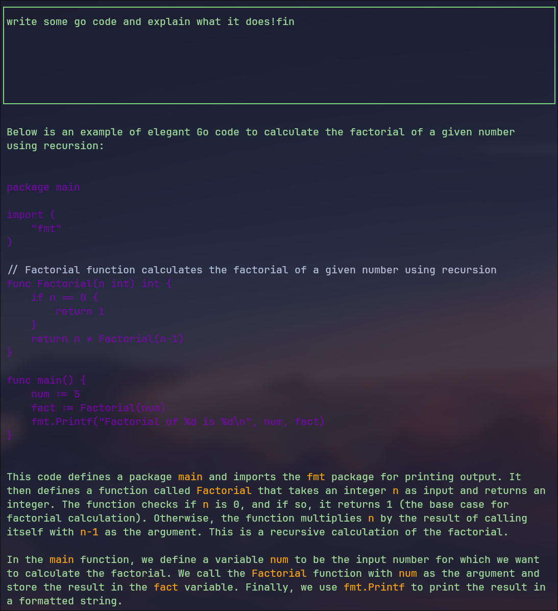

# Frnly Chatbot 🤖💬

## Table of Contents 📝
- [Introduction](##introduction)
- [Features](##features)
- [Installation](##installation)
- [Usage](##usage)
- [Customization](##customization)
- [TODO](##todo)
- [Pre-requisites](##pre-requisites)

## Introduction 🌟
Welcome to Frnly, a highly customizable chatbot built with Golang! This project leverages OpenAI's GPT API to provide you with natural, interactive, and intelligent conversations.



## Features ✨

- 📝 Text-based user interface
- 🎨 Highly customizable
- 💾 Persistent history
- 🌐 OpenAI GPT API Integration
  
## Installation 📦
```bash
git clone https://github.com/mohakim/frnly.git
cd frnly
go build
```
## Usage 📚

- **Starting Up**: Run the `frnly` executable from the terminal.
- **User Input**: Type your queries after the prompt. Use `!fin` to submit the query.
- **Clear Screen**: Type `!clear` to clear the screen.
- **Exit**: Type `!exit` to terminate the program.

## Customization 🌈

Edit the `settings.conf` file in the `~/.config/frnly` directory to customize the assistant. Here's what each setting means:

- **API_KEY**: Your OpenAI API key.
- **Temperature**: Controls the randomness of the assistant's replies.
- **Model**: The GPT model to use.
- **Prompt**: Customize the prompt text.
- **CodeBlock**: Code output color
- **UserColor**: User input color
- **BotColor**: Default assistant color
- **Context**: Control the context size (will impact token usage)

## TODO 📝

- **sessions**: Allow users to create, delete, and cycle through sessions.
- **cross-platform**: Make the program more Windows compatible.
- **encryption**: Ensure session files are encrypted.
- **tokens**: Measure with relevance to tokens and show usage statistics.
- **config**: Increase the number of configuration options
- **error-handling**: Improve resilience to errors

## Pre-requisites 📜

- GoLang >= 1.16
- OpenAI API Key
